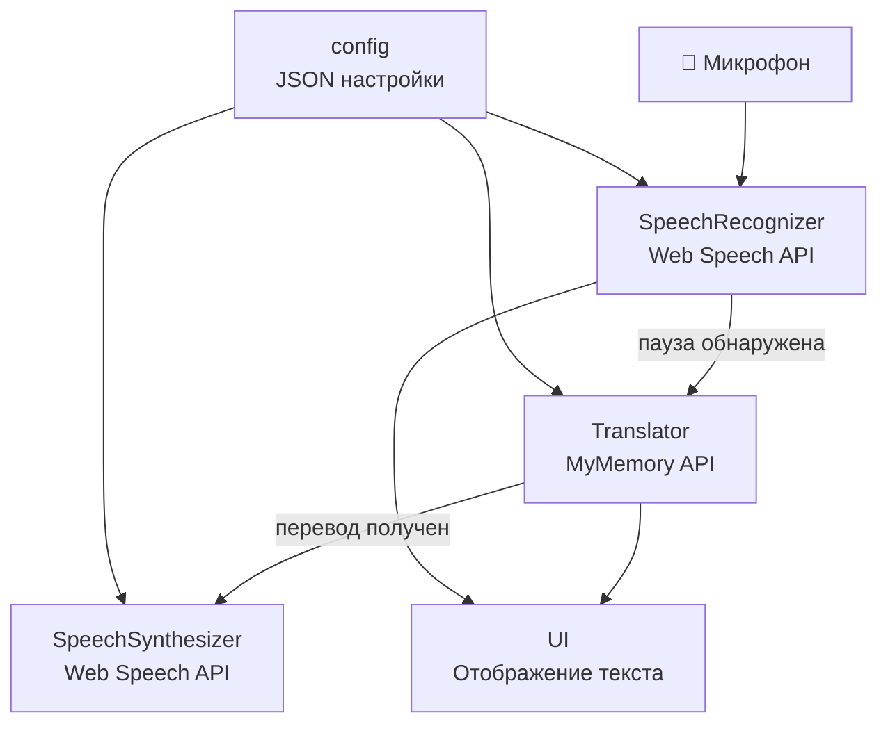
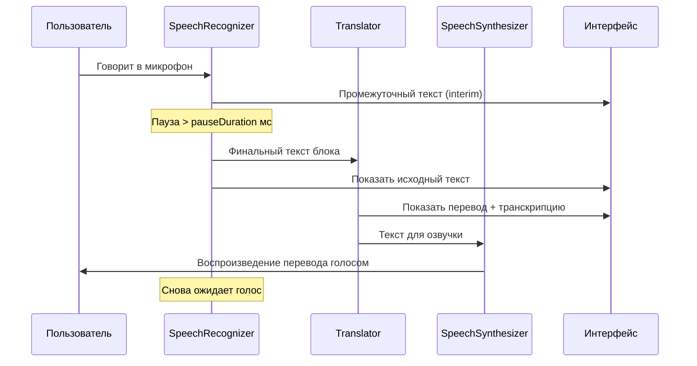
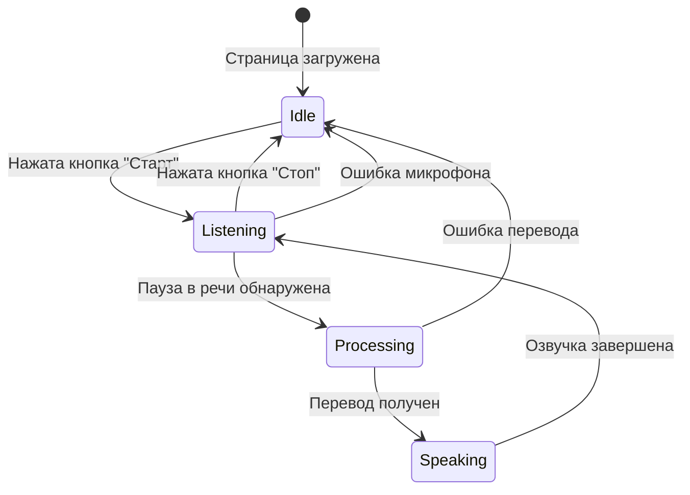

# Архитектура голосового переводчика

## Обзор решения

Голосовой переводчик — это браузерное веб-приложение на чистом JavaScript, работающее без сервера. Оно использует стандартные браузерные API для распознавания речи, перевода и синтеза речи.

---

## Компоненты системы

### 1. Модуль конфигурации (`config`)
Блок JSON внутри JS-модуля с параметрами:
- `translationDirection` — направление перевода (`"ru-en"` или `"en-ru"`)
- `voiceGender` — предпочтительный пол голоса (`"female"` / `"male"`)
- `speechRate` — скорость произношения (`1.0` — нормальная, `0.5` — медленная)
- `pauseDuration` — длительность паузы (мс) для определения конца блока речи

### 2. Модуль распознавания речи (`SpeechRecognizer`)
Использует Web Speech API (`SpeechRecognition` / `webkitSpeechRecognition`).
- Непрерывное распознавание в режиме реального времени
- Определение конца блока речи по паузе (`pauseDuration`)
- Передача итогового текста в модуль перевода

### 3. Модуль перевода (`Translator`)
Использует MyMemory API (бесплатный, без ключа) — `https://api.mymemory.translated.net/get`.
- Принимает текст и языковую пару
- Возвращает переведённый текст и транскрипцию (при наличии)

### 4. Модуль синтеза речи (`SpeechSynthesizer`)
Использует Web Speech API (`SpeechSynthesis`).
- Озвучивает перевод голосом указанного пола
- Применяет скорость из конфигурации

### 5. Модуль отображения (`UI`)
- Отображает оригинальный текст
- Отображает переведённый текст
- Отображает транскрипцию (если доступна)
- Отображает статус (ожидание, распознавание, перевод, озвучка)

---

## Диаграмма компонентов



---

## Диаграмма потока данных



---

## Диаграмма состояний



---

## Структура файлов

```
ver1/
├── index.html          # Главная страница (разметка + стили)
├── translator.js       # JS-модуль (логика + конфигурация)
├── architecture.md     # Данный файл — архитектура решения
└── alternatives.md     # Обзор альтернативных подходов
```

---

## Технологический стек

| Компонент         | Технология                        | Причина выбора                          |
|-------------------|-----------------------------------|-----------------------------------------|
| Распознавание речи | Web Speech API (SpeechRecognition) | Стандартный браузерный API, без сервера |
| Перевод           | MyMemory REST API                 | Бесплатный, без ключа, поддерживает ru↔en |
| Синтез речи       | Web Speech API (SpeechSynthesis)  | Стандартный браузерный API              |
| Интерфейс         | HTML5 + CSS3 + Vanilla JS         | Без зависимостей, легко деплоить        |
| Хостинг           | GitHub Pages / локально           | Статический файл, не нужен сервер       |

---

## Ограничения и проблемные моменты

### Браузерная совместимость
- `SpeechRecognition` поддерживается в Chrome и Edge. Firefox не поддерживает (по умолчанию).
- `SpeechSynthesis` поддерживается везде, но набор голосов зависит от ОС.

### Определение паузы
- Определение конца блока речи основано на таймере (`pauseDuration`). При быстрой речи с короткими паузами возможны ложные срабатывания.
- `SpeechRecognition` не всегда корректно обрабатывает тишину — возможны race condition между `onresult` и `onspeechend`.

### GitHub Pages и HTTPS
- `SpeechRecognition` требует HTTPS. GitHub Pages предоставляет HTTPS автоматически.
- Для локальной работы нужен либо `localhost`, либо HTTPS-сертификат.

### Ограничения MyMemory API
- Лимит: 5000 символов/день без ключа, 10000 с бесплатным ключом.
- Возможна задержка сети. При переводе длинного блока задержка может быть заметна.
- Транскрипция доступна не для всех языков.

### Синтез речи
- Доступность и качество голоса зависит от системы.
- Выбор голоса по полу (`voiceGender`) — эвристика по имени голоса, не гарантирована.
- Озвучка может перекрываться, если предыдущий блок ещё не завершён (решается отменой текущего синтеза).
